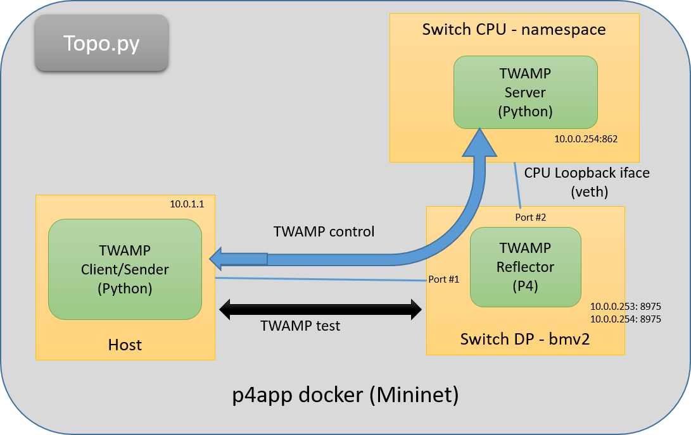

P4 Twamp reflector implementation in P4
=====

This repo contains P4 Twamp reflector implemented in P4 and deployed using p4app tool (https://github.com/p4lang/p4app) in mininet/bmv2 enviroment. In order to test the solution the mininet enviroment contains also simple TWAMP server running with standard Linux TCP/IP stack and twping client.



The TWAMP implementation and testing was done within the GEANT Data Plane Programmibilty activity:
* https://wiki.geant.org/display/NETDEV/DPP

p4app
-----

p4app is a tool that which can be used to build, run, debug, and test P4 programs. The philosophy behind p4app is "easy things should be easy" - p4app is designed to make small, simple P4 programs easy to write and easy to share with others.


Installation
------------

1. Install [docker](https://docs.docker.com/engine/installation/) if you don't already have it.

2. If you want, put the `p4app` script somewhere in your path. For example:

    ```
    cp p4app /usr/local/bin
    ```

Usage
-----

To run docker based mininet enviromnent with bmv2 switch serving as TWAMP protocol reflector:

```
p4app run twamp_reflector.p4app
```
